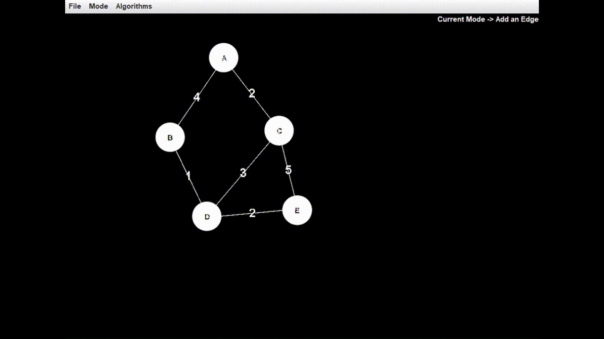

# Graph Algorithm Visualizer

An interactive Java-based desktop application to visualize classic graph traversal and pathfinding algorithms such as **BFS**, **DFS**, **Dijkstra’s**, and **Prim’s**. Built using **Java Swing**, this visual tool allows users to create and analyze custom graphs with real-time animations and edge weights.

---

## Features

- Click-based interface to add/remove vertices and edges
- Dynamic GUI with real-time updates using Java Swing
- Visualize algorithms:
  - Breadth-First Search (BFS)
  - Depth-First Search (DFS)
  - Dijkstra’s Shortest Path
  - Prim’s Minimum Spanning Tree
- Input and render edge weights
- Smooth animated transitions
- AI optimization toggle (based on edge usage data)

---

## Demo



---

## Getting Started

### Prerequisites

- Java Development Kit (JDK) 8 or above
- Any Java IDE (e.g., IntelliJ IDEA, Eclipse, VS Code with Java extensions)

### Running the App

#### Option 1: Using an IDE

1. Clone this repository
2. Open the project in your preferred IDE
3. Run `MainFrame.java` as a Java Application

#### Option 2: From the Terminal

```bash
git clone https://github.com/your-username/graph-algorithm-visualizer.git
cd graph-algorithm-visualizer
javac visualizer/*.java algorithms/*.java
java visualizer.MainFrame
